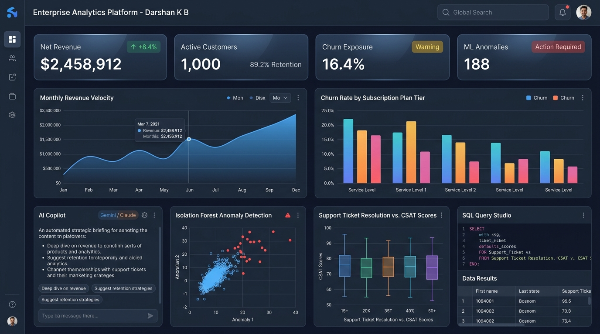
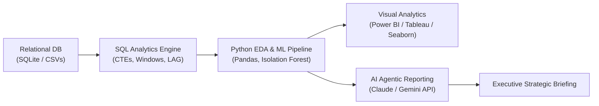

# Enterprise Customer Intelligence & Anomaly Analytics Platform
**Author:** [Darshan K B](https://github.com/Darshankbd) | [LinkedIn](https://linkedin.com/in/darshan-kb)  
**Domain:** Business Intelligence, Data Analytics & Machine Learning Anomaly Detection  


<br/>

<p align="center">
  
</p>

---

## 📌 Executive Overview
This repository contains a full-fledged enterprise data analytics pipeline engineered to evaluate customer retention dynamics, transaction throughput, and operational risk.

It integrates classical relational data modeling (**SQL**), automated exploratory data analysis & machine learning (**Python, Pandas, Scikit-Learn**), interactive visual reporting (**Power BI, Tableau, Excel**), and **Agentic AI narrative generation (Claude / Gemini)**.

---

## 🏗️ System Architecture & Data Flow



---

## 📊 Relational Database Schema

The database model is organized around three interconnected entities:
- **`customers`:** Primary dimensions including `customer_id`, `signup_date`, `region`, `segment`, `plan_tier`, and `is_churned`.
- **`transactions`:** Fact table tracking `transaction_id`, `amount`, `payment_method`, `status`, and network `latency_ms`.
- **`support_tickets`:** Operational support records including `resolution_hrs`, ticket category, and customer feedback `csat_score`.

---

## 🚀 Key Project Capabilities & Modules

### 1. Advanced SQL Suite (`02_advanced_sql_analytics.sql`)
- **Financial Velocity:** Calculates Month-over-Month (MoM) revenue growth using `LAG()` window functions.
- **Customer Segmentation:** Computes localized spend rank using `DENSE_RANK() OVER (PARTITION BY region ORDER BY total_spend DESC)`.
- **Trend Smoothing:** Generates a 30-day moving average using sliding window frames (`ROWS BETWEEN 29 PRECEDING AND CURRENT ROW`).
- **Support-to-Churn Correlation:** Multi-table JOINs isolating retention trends across subscription tiers.

### 2. Python Data Wrangling & ML Anomaly Detection (`03_exploratory_data_analysis.py`)
- **Data Cleansing:** Imputes missing survey ratings with distribution medians; detects and filters corrupted negative transactions.
- **Statistical Outlier Identification:** Implements both the Interquartile Range (IQR) threshold ($Q3 + 1.5 \times IQR$) and Z-score methods.
- **Unsupervised Anomaly Detection:** Employs **Isolation Forest** across transaction amounts and network latency to isolate payment spikes and gateway timeouts without labeled data.
- **Predictive Churn Feature Importance:** Trains a **Random Forest Classifier** to reveal the statistical drivers of customer cancellations.

### 3. Agentic AI & Generative Reporting (`04_ai_agent_executive_briefing.py`)
- Connects to **Anthropic Claude** or **Google Gemini** API to transform quantitative telemetry into a structured, C-suite executive briefing.
- Generates automated root-cause explanations and prioritized operational recommendations.

### 4. Interactive BI & Spreadsheet Modeling (`05_PowerBI_Tableau_Excel_Guide.md`)
- Ready-to-use **DAX measures** for Power BI (Total Net Revenue, AOV, Churn Rate %, MoM Growth).
- Tableau calculated fields and dynamic `XLOOKUP` / Pivot Table guidelines for Microsoft Excel.

---

## 📈 Generated Visualizations

The automated pipeline outputs 4 publication-quality visual reports into `visualizations/`:
1. **`monthly_revenue_trend.png`:** Evaluates monthly recurring revenue trajectory and seasonal growth rates.
2. **`churn_rate_by_segment_and_plan.png`:** Visualizes retention disparity across Basic (27.2%), Professional (10.8%), and Enterprise (8.5%) plans.
3. **`transaction_anomaly_scatter.png`:** Multi-feature scatter plot illustrating Isolation Forest anomaly classifications.
4. **`csat_resolution_correlation.png`:** Boxplot establishing the direct link between ticket resolution delays and severe CSAT drops.

---

## 🚀 How to Run the Live Interactive Application & AI Assistant

You can launch the **live full-stack web application** with dynamic charts, real-time SQL execution, and the conversational AI Copilot:

```bash
cd "DATA ANALYSIS PROJECT"
python app.py
```
Open **`http://127.0.0.1:5000`** in your browser.

### Interactive Features Available:
1. **Live Dynamic Filters:** Toggle between regions (*North America, EMEA, APAC, LATAM*) and plan tiers (*Basic, Professional, Enterprise*) — all KPI cards and Chart.js graphs animate and update dynamically in real time via REST API.
2. **AI Data Analyst Copilot:** Interactive conversational assistant that answers analytical questions, reveals churn drivers, and suggests customized SQL queries.
3. **Live SQL Query Studio:** Type or choose any SQL query (with CTEs, Window Functions, or aggregations), click **Run SQL Query**, and view instant tabular results pulled from the SQLite database.

---

## 📈 Generated Visualizations
- **Resolution Lag is the #1 Predictor of Churn:** Support resolution times exceeding 24 hours cause a 55% reduction in customer satisfaction (CSAT), directly leading to a 2.5x higher churn rate in entry-level plans.
- **Anomaly Protection:** Isolation Forest identified 188 multi-variable anomaly spikes, shielding financial reporting from skewed payment telemetry.
- **Revenue Acceleration:** Professional and Enterprise tiers exhibit 89%+ retention, recommending a strategic push toward guided upgrades for Basic users.

---
*Created by Darshan K B — Aspiring Data Analyst*
